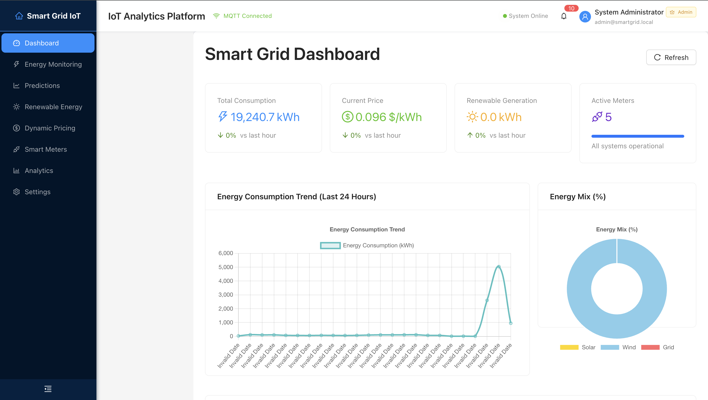
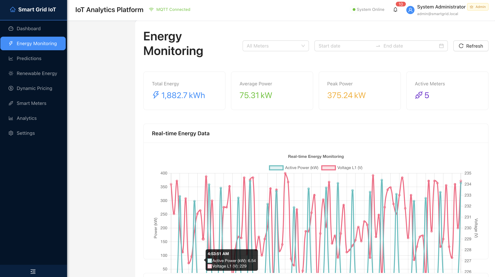
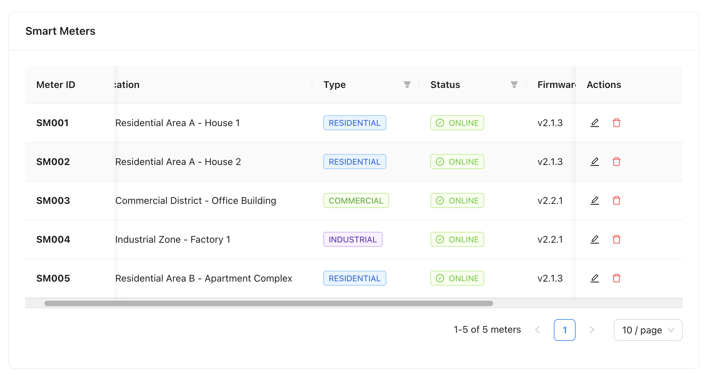
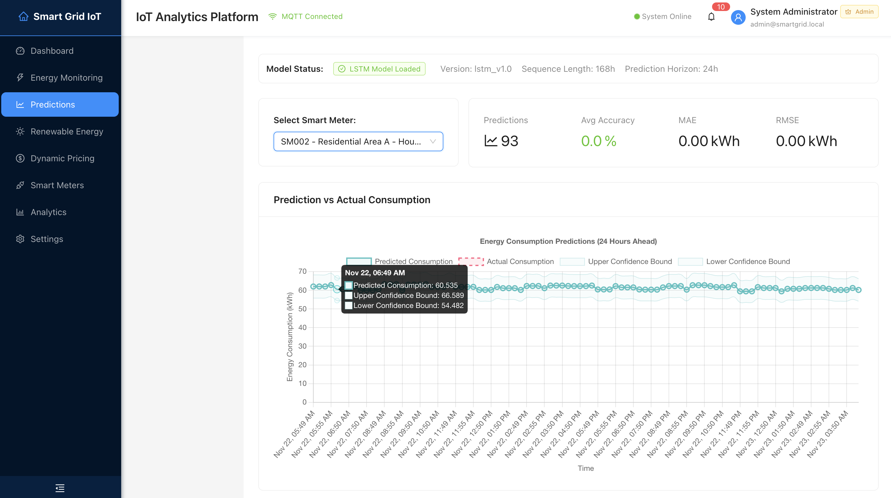

# Smart Grid IoT Analytics Platform

A comprehensive IoT analytics platform for smart grid energy management with real-time monitoring, ML-powered predictions, and intelligent energy optimization.


## Features

- Secure Authentication: Role-based access control with JWT tokens
- Real-time Dashboard: Live energy monitoring and analytics
- ML Predictions: LSTM neural networks for 24-hour energy forecasting
- Smart Meters: IoT device management and real-time data collection
- Dynamic Pricing: Intelligent pricing optimization algorithms
- Renewable Energy: Solar and wind energy forecasting
- MQTT Integration: Real-time IoT data streaming
- Modern UI: Beautiful, responsive React interface

## Screenshots

### Login Page


### Dashboard


### Energy Monitoring


### Smart Meters Management


### Energy Predictions


## Quick Start

### Prerequisites
- Docker & Docker Compose
- 8GB+ RAM recommended
- Ports available: 3000, 8000, 1880, 1883, 5432, 6379

### Installation

```bash
# Clone the repository
git clone https://github.com/Sai-04021210/Smart-Grid-IoT-Analytics.git
cd Smart-Grid-IoT-Analytics

# Start everything
docker compose up -d
```

Wait 2-3 minutes for initial build.

### Access the Platform

| Service | URL | Credentials |
|---------|-----|-------------|
| Web Dashboard | http://localhost:3000 | admin / 1234 |
| API Docs | http://localhost:8000/docs | admin / 1234 |
| Node-RED | http://localhost:1880 | No auth required |

### Stop Services

```bash
docker compose down
```

## Technology Stack

- Backend: FastAPI 0.110.x, Python 3.11
- Frontend: React 18.2.x, Vite 5.2.x, TypeScript
- Machine Learning: TensorFlow 2.16.x, scikit-learn 1.4.x
- Database: PostgreSQL 15, SQLAlchemy 2.0.x
- Message Broker: Eclipse Mosquitto MQTT
- Visualization: Ant Design, Plotly.js, Chart.js
- Containerization: Docker & Docker Compose

## License

This project is licensed under the MIT License - see the LICENSE file for details.
